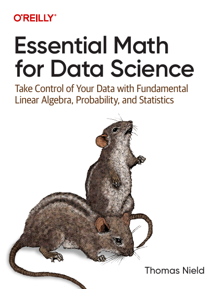

## Essential Math for Data Science

this place for solving problem of this book and creat a brief of this book a summerize for better learning :)

> **every day 20 page to read - please :D**

### Chapters

- [ ] [Basic Math and Calculus Review](/Basic-Math-and-Calculus-Review)
- [ ] Probability
- [ ] Descriptive and Inferential Statistics
- [ ] Linear Algebra
- [ ] Linear Regression
- [ ] Logistic Regression and Classification
- [ ] Neural Networks
- [ ] Career Advice and the path forward :D

- [ ] Supplemental Topics

#### Pomodoro Technique

The Pomodoro Technique is a time management method developed by Francesco Cirillo in the late 1980s. It uses a kitchen timer to break work into intervals, typically 25 minutes in length, separated by short breaks. Each interval is known as a pomodoro, from the Italian word for tomato, after the tomato-shaped kitchen timer Cirillo used as a university student.

https://pomofocus.io/
